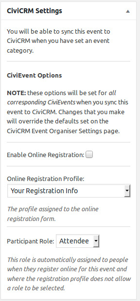
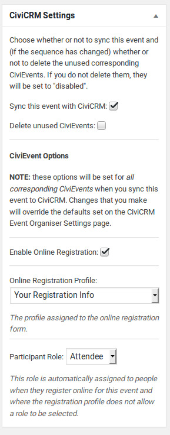
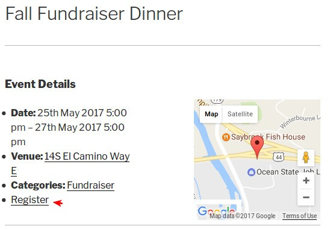

## Events integration

When adding a New Event in Event Organiser there are now some CiviCRM Settings that can be used if event will use CiviCRM integration for Registration.  When adding a New Event there are fewer settings visible.

Once your event details are in place, if this event will also be in CiviCRM, it is required to Select an Event Category for the CiviCRM Sync option to be enabled and event published. Then click on the **Sync this event with CiviCRM** option for the event to be created in CiviCRM.

If you will also be enabling Registration, select the **Enable Online Registration** option and select the Profile and Participant Role. The default [settings](./settings.md) will be used if nothing is changed.

Once you've enabled registration when viewing an event on the website, there will be a Register link that brings visitors to the CiviCRM Event Registration page for that event.

### User permissions
For users to sync events to CiviCRM, they must have `publish_posts` and `access CiviEvent` capabilities
